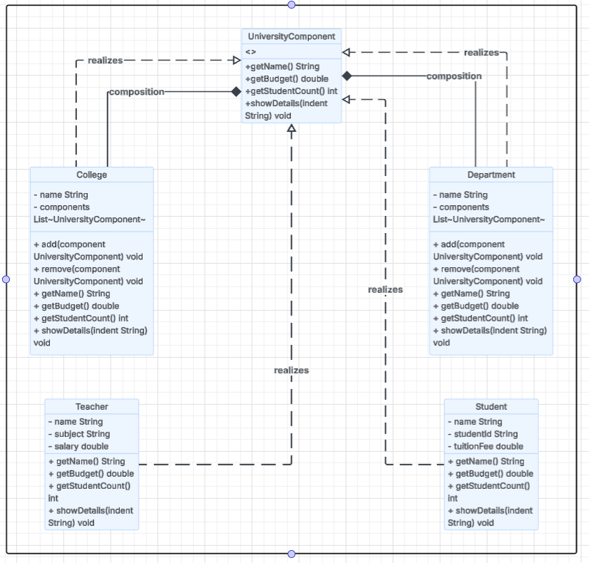

# Lab-Assignment-8-Composite-Design-Pattern

# 🏫 University System (Composite Design Pattern)

## 📌 Overview
This project models the organizational structure of a university using the **Composite Design Pattern**. It represents hierarchical relationships between Colleges, Departments, Teachers, and Students.

The system supports:
- Hierarchical structure (part-whole relationship)
- Student count calculation
- Budget calculation
- Structured display of details

---

## 🧩 Design Pattern Used

### Composite Design Pattern
This pattern allows individual objects and compositions of objects to be treated uniformly.

- **Component** → `UniversityComponent`
- **Composite** → `College`, `Department`
- **Leaf** → `Teacher`, `Student`

---

## 🏗️ UML Class Diagram

